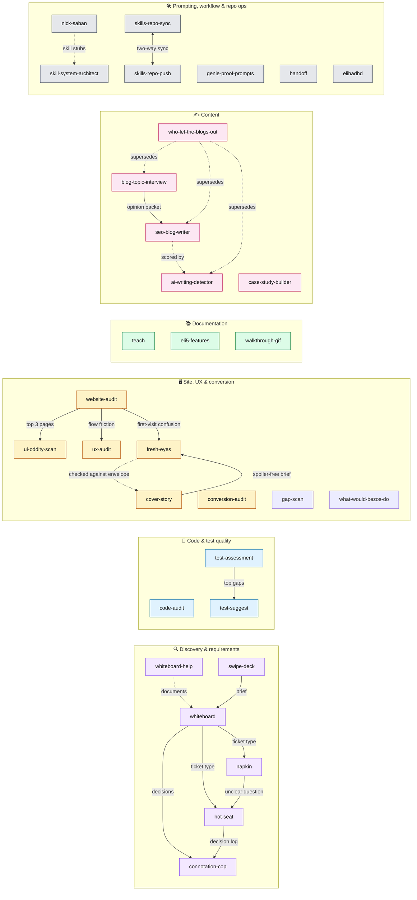

# Skills

[](https://github.com/Theycallmeholla/skills/actions/workflows/validate.yml)
[](#skill-index)
[](#authoring-a-skill)
[](#continuous-integration)
[](LICENSE)

**30 production skills for Claude** (Claude Code / Cowork) covering codebase audits, test strategy,
UX and conversion reviews, requirements interviews, documentation generation, content production,
and the meta-work of building and maintaining skills themselves.

Every skill is a self-contained folder under `skills/` with a `SKILL.md` (YAML frontmatter +
instructions) plus whatever `references/`, `assets/`, `scripts/`, `evals/`, or `tests/` it needs.
Nothing here depends on anything outside its own folder, so a skill can be copied out one directory
at a time.

| | |
|---|---|
| **Skills** | 30 |
| **Bundled reference files** | 79 |
| **Templates & assets** | 8 |
| **Executable scripts** | 21 (12 shell, 8 Python, 1 Node) |
| **Total files** | 140 |
| **Enforced in CI** | spec validator, secret scan, `shellcheck`, Playwright regression suite |
| **License** | MIT |

---

## Table of contents

1. [How the skills fit together](#how-the-skills-fit-together)
2. [Quick start](#quick-start)
3. [Skill index](#skill-index)
4. [Workflow chains](#workflow-chains)
5. [Full skill reference](#full-skill-reference)
6. [Repository layout](#repository-layout)
7. [Authoring a skill](#authoring-a-skill)
8. [Continuous integration](#continuous-integration)
9. [Never-publish list](#never-publish-list)
10. [Conventions that show up everywhere](#conventions-that-show-up-everywhere)
11. [License](#license)

---

## How the skills fit together



Solid arrows are real handoffs — one skill produces an artifact another consumes. Dashed arrows are
documentation, scoring, or supersession relationships.

---

## Quick start

**Claude Code — one skill**

```bash
git clone https://github.com/Theycallmeholla/skills.git
cp -R skills/skills/code-audit ~/.claude/skills/
```

**Claude Code — the whole repo, safely**

Use the `skills-repo-push` skill. It dry-runs first, classifies every skill `NEW` / `CHANGED` /
`IDENTICAL`, backs up what it replaces, leaves local-only skills alone, and preserves accumulated
local state files (opinion banks, `state.json`) instead of overwriting them.

```
push skills out              # dry run — shows the diff, writes nothing
push skills out --apply      # writes, after backing up to /tmp
```

**Claude app (Cowork)**

Upload a skill folder directly, or let `skills-repo-push` build the tarball for you at
`/tmp/skills-push-<timestamp>.tar.gz` containing only what actually changed.

**Going the other way** — `skills-repo-sync` finds custom skills on your machine that are missing
from this repo, copies them in, updates this README's index, scans for secrets, and asks before
every addition and before the push.

**Invoking a skill** — most fire from natural language, since the `description` frontmatter is the
trigger surface. Anything with a command-style name can also be called directly: `/teach payments`,
`wltbo write`, `work the board`.

---

## Skill index

One line per skill. Full detail in [Full skill reference](#full-skill-reference).

### Code quality & testing

- **code-audit** — nine-phase whole-repo audit (security, quality, performance, dependencies, architecture, tests, docs) into a severity-ranked report with a 30/60/90 plan
- **test-assessment** — audits an existing test suite: what's missing, what's weak, which gaps carry real risk, on a risk × coverage matrix
- **test-suggest** — turns one module or one assessment finding into a prioritized list of specific test cases, stopping short of writing code

### Requirements & discovery

- **swipe-deck** — Tinder-style swipe interview with a live saturation meter that decides when it has heard enough, then writes the brief
- **hot-seat** — one question per message, each shipped with Claude's own pick, until a plan holds up; emits a decision log
- **napkin** — throwaway code that answers exactly one written design question, then gets deleted
- **connotation-cop** — polices project vocabulary, keeps a `CONTEXT.md` glossary sharp, and books qualifying decisions as numbered ADRs
- **whiteboard** — plans work too big for one session as a map of investigation tickets on GitHub Issues, one ticket per session
- **whiteboard-help** — display-only cheat sheet for the whiteboard system: the flow, the exact phrases, the rules, where artifacts live
- **blog-topic-interview** — pre-writing interview that captures the author's real stances and stories, producing an Opinion Packet

### Site, UX & conversion

- **website-audit** — end-to-end crawl and scored report in two modes: PROSPECT (outreach evidence plus a portable `audit_packet.json`) and QA (pre-launch ship gate)
- **ux-audit** — reconstructs a flow from code, a live app, or a spec, then audits it across 11 phases for confusion, friction, and drop-off
- **ui-oddity-scan** — per-page scan for repeated facts, restated sections, stray text, placeholder copy, and mismatched imagery, with pinned screenshot crops
- **gap-scan** — finds the features a product is obviously missing (no export, no bulk, no search, dead-end workflows) in PROSPECT or QA mode, evidence-gated and capped at 10 findings, with a portable `gap_packet.json`
- **what-would-bezos-do** — mines a codebase for underexploited existing assets and platform primitives, gated by an evidence chain and capability-maturity ladder, capped at 5 opportunities with a mandatory kill list and a portable `wwbd_packet.json`
- **conversion-audit** — audits a page against the ONE action it wants, using five cold-read persona agents and a belief-chain map
- **fresh-eyes** — genuine first-time-user test that protects its own ignorance and logs every confusion at the moment of impact
- **cover-story** — writes the spoiler-free brief a fresh-eyes tester is handed, plus a sealed envelope of everything deliberately withheld

### Documentation

- **teach** — traces a feature through the codebase and writes a developer-facing "how X works" doc with real code excerpts
- **eli5-features** — reads the code and writes plain-language end-user help docs using the app's actual on-screen wording
- **walkthrough-gif** — generates a runnable Stagehand + Playwright project that records a browser walkthrough as MP4 and GIF

### Content

- **who-let-the-blogs-out** — twelve-command blog system with per-client memory: brand, plan, interview, verify, brief, write, images, review, revise, publish, refresh, help
- **seo-blog-writer** — research-driven SEO articles built on SERP analysis, a verified claim ledger, and a weighted quality rubric
- **ai-writing-detector** — weighted 0–100 AI-tells scorecard with quoted evidence and fixes ranked by score impact
- **case-study-builder** — mines existing files, asks only the gap questions, and ships web-ready case study copy plus a media plan

### Prompting, workflow & repo ops

- **nick-saban** — builds, scores, and hardens the Claude Code harness for a repo (CLAUDE.md, rules, hooks, permissions, CI) across eight commands
- **skill-system-architect** — designs the state schema, command map, and router for a multi-command skill system before any file gets written
- **genie-proof-prompts** — audits a prompt across ten loophole categories, rewrites it airtight, and shows what the genie would have done
- **handoff** — compacts a session into a dense resume-from-zero document, with a redaction sweep and facts separated from assumptions
- **elihadhd** — restructures responses for an ADHD brain: TL;DR first, verb-first steps, one recommended path, and it stays in that mode
- **skills-repo-sync** — finds local skills missing from this repo, adds them in the expected format, updates this index, commits, and asks before pushing
- **skills-repo-push** — the reverse: repo → `~/.claude/skills`, dry-run by default, with backups, local-only skills untouched, and state files preserved

---

## Workflow chains

Skills designed to run in sequence. Each arrow is a real artifact handoff.

**Plan something too big for one session**

```
whiteboard (draw)  →  whiteboard (work — one ticket per session)
                        ├─ hot-seat ticket   → decision log
                        ├─ napkin ticket     → QUESTION / ANSWER / EVIDENCE
                        └─ research ticket   → resolution comment
                   →  connotation-cop (ADRs + CONTEXT.md glossary)
                   →  whiteboard (snapshot)  →  spec / handoff
```

**Inherit or evaluate a codebase**

```
code-audit       →  findings report + 30/60/90 plan
test-assessment  →  risk × coverage matrix  →  test-suggest (top gaps)  →  you write the tests
```

**Ship a site and prove it works**

```
website-audit (QA mode)
   ├─ ui-oddity-scan    (top 3 pages — per-page copy and layout oddities)
   ├─ ux-audit          (flow-level friction)
   ├─ conversion-audit  (does every element serve the ONE action?)
   └─ cover-story  →  fresh-eyes  →  compare the report against the sealed envelope
```

**Write something publishable under a real name**

```
who-let-the-blogs-out:
  brand → plan → interview → verify → brief → write → images → review → revise → publish
                                                                          ↑
                                                        refresh (for aging posts)
```

The standalone `blog-topic-interview → seo-blog-writer → ai-writing-detector` chain is the earlier,
lighter version of the same pipeline. `who-let-the-blogs-out` supersedes all three and aliases their
names to `interview`, `brief` + `write`, and `review`. Reach for the standalone skills when you want
one step without adopting the `.blog/` state directory.

**Build a skill system, then keep it honest**

```
skill-system-architect  →  architecture spec  →  skill-creator (writes the files)
nick-saban:  gameplan → work → watch-film → check-playbook → adjust / drill / decline
skills-repo-sync (local → GitHub)          skills-repo-push (GitHub → local)
```

---

## Full skill reference

Each entry expands. **Bundle** lists what ships inside the skill folder beyond `SKILL.md`.

### Code quality & testing

<details>
<summary><b>code-audit</b> — nine-phase whole-repository audit with a severity-ranked findings report</summary>

**What it does** — Runs security, code quality, performance, dependency, architecture, testing, and
docs passes over an entire repository and produces a prioritized remediation report.

**Say something like** — "audit this codebase", "review this repo", "security review",
"what's wrong with this codebase", "due diligence on this project", "can you eyeball my repo".

**Input** — A repo path, a URL to clone, or an uploaded file tree. Shell access enables the bundled
scripts; without it, it degrades to read-only file-tree walking.

**Output** — Executive summary (5–8 lines), a findings table (ID, severity Critical→Info, category,
title, `file:line`), expanded findings with an evidence excerpt, a fix, and S/M/L effort, a
"what's good" section, and a prioritized 30/60/90-day plan.

**Mechanics** — Phase 1 (inventory) is mandatory and gates everything after it. Every finding must
cite `file:line` and be verified — no speculative alarms. Above roughly 100k LOC or 2,000 files it
switches to stratified sampling plus a git-churn hotspot scan, and farms phases 2, 3, and 5 out to
parallel subagents merged at phase 9.

**Bundle** — `scripts/inventory.sh`, `scripts/scan_secrets.sh`, `scripts/find_smells.sh`,
`scripts/deps_check.sh`; `references/` for security, quality, performance, dependencies,
architecture, and per-language notes; `assets/report-template.md`.

**Not for** — Diffs or pending changes (the built-in `code-review` / `security-review` skills cover
those), or single-function reviews.
</details>

<details>
<summary><b>test-assessment</b> — where tests are missing, where they're weak, and which gaps matter</summary>

**What it does** — Audits an existing test suite and reports gaps ranked by the risk of the code
they leave uncovered.

**Say something like** — "is this tested?", "audit our tests", "what's our coverage like",
"where should we add tests", "do we have testing gaps".

**Input** — A repo path with shell access; optionally existing coverage artifacts (`coverage/`,
`lcov.info`, `coverage.xml`) and CI config.

**Output** — Executive summary, the raw numbers, a risk × coverage matrix
(Critical/High/Medium/Low × None/Sparse/Partial/Solid), top gaps expanded as findings,
severity-ranked quality findings, what's working, and a 30/60/90 plan.

**Mechanics** — Seven ordered phases: inventory → coverage artifacts (it never runs your suite) →
risk map → smell scan → test-type balance → CI hygiene → report. The risk map is the heart of it,
flagging money, auth, deletion, crypto, and parser paths. Over 100k LOC it samples the 20
most-changed files plus risk-named directories, and says so in the report.

**Bundle** — `scripts/test_inventory.sh`, `scripts/risk_map.sh`, `scripts/test_smells.sh`;
`references/risk-mapping.md`, `test-smells.md`, `test-types.md`, `language-notes.md`;
`assets/report-template.md`.

**Not for** — Writing tests, running the suite, or generating coverage. Hands off to `test-suggest`.
</details>

<details>
<summary><b>test-suggest</b> — specific test cases for one target, without writing the code</summary>

**What it does** — Reads one module (or one pasted `test-assessment` finding) and proposes concrete,
prioritized test cases.

**Say something like** — "what should I test in auth.ts", "give me test ideas for this module",
"what test cases would catch real bugs here", "how do I close this coverage gap".

**Input** — A named target file, or an assessment finding that names files, plus the repo's existing
tests so it can match conventions. A bare "what should I test?" is refused until a target is named.

**Output** — A header (targets, detected framework, where tests should live), an "already covered"
section, then numbered suggestions grouped Must-have / Should-have / Nice-to-have — each with Name,
Type, Setup, Action, Assert, Why, and an optional "watch out for" — plus an "untestable as-written"
section.

**Mechanics** — Eight phases: classify the request mode, inspect the target, learn conventions from
two or three neighboring test files, subtract what's already covered, design cases, assign a type
per case, prioritize (3–7 must-haves max), compose. Targets over 500 lines or 20+ exports are
sampled down to the 5–8 highest-leverage behaviors, and it says so.

**Bundle** — `scripts/inspect_target.sh`; `references/case-design.md`, `test-types.md`,
`untestable-code.md`, `language-notes.md`; `assets/suggestion-template.md`.

**Not for** — Writing or running test code, refactoring untestable code, or repo-wide assessment.
</details>

### Requirements & discovery

<details>
<summary><b>swipe-deck</b> — Tinder-style requirements interview with a saturation meter</summary>

**What it does** — Turns a vague, taste-dependent request into a written brief by having you swipe
through a deep pool of question cards instead of answering a wall of clarifying questions.

**Say something like** — "swipe", "tinder style", "interview me", "20 questions me", "figure out
what I want" — or any request where you'd otherwise be asked more than three questions in a row.

**Input** — A vague prompt plus a widget-rendering tool. Falls back to a numbered chat list you
answer with shorthand like `1r 3l 5u 7d` (right / left / up / down = yes / no / absolutely / not
sure).

**Output** — The rendered deck, then a brief with fixed sections: The shape of it, Locked in, Ruled
out, Still fuzzy, The tension I'm reading, First thing I'd do — and then it stops and asks rather
than building.

**Mechanics** — Claude names 5–7 facets, authors 70–110 cards into deck JSON, and pastes it into
`assets/deck.html` verbatim. The client-side saturation meter is
`0.45 × coverage + 0.40 × prediction accuracy + 0.15 × depth`, capped below 70% while any facet is
uncovered, and fires a single handoff at 85%. Editing a card's wording voids the prediction as a
miss — the deck learns from being wrong about you.

**Bundle** — `assets/deck.html` (the widget, with a `__DECK_JSON__` slot);
`references/question-craft.md` (facet lenses, eight card styles, pool ratios);
`references/worked-example.md` (a full prompt → pool → handoff → brief trace);
`tests/run.js` (~30-check Playwright regression suite — see [CI](#continuous-integration)).

**Not for** — Requests that are already well-specified. It never starts building from the brief
without asking.
</details>

<details>
<summary><b>hot-seat</b> — one question at a time until the plan actually holds up</summary>

**What it does** — Interrogates a plan or decision one question per message, each paired with
Claude's own recommendation, until both parties hold the same picture.

**Say something like** — "hot seat me", "grill me", "stress-test this", "poke holes in this",
"am I missing anything", "challenge this before I build it".

**Input** — The plan, plus repo access so facts get looked up rather than asked about.

**Output** — A `## Decisions` block, one line per decision with its rationale — the artifact
`connotation-cop` and `whiteboard` consume.

**Mechanics** — Rule zero: one question per message. Batching is banned, and "Also," is the tell.
Facts are researched, genuine choices always come to you, and every question ships with "My pick."
Upstream decisions are asked first. After two "whatever you think" answers it flips to
recommend-and-confirm — one list, one yes-or-adjust.

**Bundle** — `SKILL.md` only.

**Not for** — Building anything, or producing plans and code. It pressure-tests and records.
</details>

<details>
<summary><b>napkin</b> — throwaway code that answers exactly one design question</summary>

**What it does** — Builds deliberately disposable code to settle one question you can only answer by
seeing or driving it: a tiny terminal app for a state/logic model, or several radically different UI
variants switchable on one route.

**Say something like** — "prototype this", "mock it up", "sketch a version", "try a few designs",
"see what it'd look like", "feel out this state machine".

**Input** — One design question, plus the surrounding project (task runner, routes, a page to host
variants in).

**Output** — Code with `napkin`/`prototype` in the path, one run command wired into the project's
task runner, and a durable `QUESTION / ANSWER / EVIDENCE` capture block. Then the code is deleted or
rewritten properly.

**Mechanics** — A gate comes first: write the QUESTION line before any code, or stop and run
`hot-seat` to find it. Then branch to the logic or UI reference. Six house rules — visibly
throwaway, one command, no persistence, zero polish, full state printed after every action, and
timeboxed.

**Bundle** — `references/logic.md` (a portable reducer behind a throwaway terminal shell),
`references/ui.md` (N variants plus a floating switcher via `?variant=`).

**Not for** — A v1 or a head start. Napkin code is never promoted as-is.
</details>

<details>
<summary><b>connotation-cop</b> — glossary enforcement and ADRs, booked mid-conversation</summary>

**What it does** — Challenges vague or overloaded project vocabulary, writes settled terms into a
root `CONTEXT.md` glossary, and records qualifying decisions as numbered ADRs.

**Say something like** — "what should we call this", "pin down the terminology", "these two words
mean the same thing", "record this decision", "write an ADR for that".

**Input** — The live naming conversation, any existing `CONTEXT.md` and `docs/adr/`, and the
codebase for verification.

**Output** — Glossary entries (term, one-line definition, `_Avoid_:` list), sequentially numbered
`docs/adr/NNNN-slug.md` records, and a `CONTEXT-MAP.md` only in genuinely multi-context repos.

**Mechanics** — Four beats: enforce the glossary against your live wording, bust vague terms one
question at a time (hot-seat rules), run the ugly scenario that exposes divergent mental models, and
verify claims against code before agreeing. Files are created lazily, and entries are booked
mid-conversation rather than batched at the end. The ADR bar requires all three of: hard to reverse,
surprising without context, and a real trade-off.

**Bundle** — `references/context-format.md`, `references/adr-format.md`.

**Not for** — Merely reading the glossary, or letting implementation detail leak into `CONTEXT.md`.
</details>

<details>
<summary><b>whiteboard</b> — multi-session planning as a map of tickets on GitHub Issues</summary>

**What it does** — Breaks work too big for one agent session into one open decision per GitHub issue
under a `whiteboard:map` board, worked one ticket per session, then synthesized.

**Say something like** — "whiteboard this: [idea]", "work the board", "work the board, ticket
[name]", "snapshot the board".

**Input** — Explicit invocation, a git repo with GitHub Issues and the `gh` CLI, and — in later
sessions — the board number.

**Output** — A board issue (destination, notes, decisions index, parking lot, out-of-scope), its
sub-issue tickets, resolution comments, and finally a snapshot artifact: a spec, a locked decision
record, or a handoff doc. Every session ends with a verbatim sign-off block — board count, this
session, next up, what to say.

**Mechanics** — Three modes. Draw pins the destination, fills breadth-first, creates tickets, and
wires blocking edges on a second pass. Work claims the first up-next ticket, loads the sub-skill its
type names, resolves, records, and tends the board. Snapshot verifies, synthesizes, delivers, and
closes. Ticket types are research, napkin, hot-seat, and task. Seven hard rules, including one
ticket per session, claim before work, names not numbers, and split rather than swell.

**Bundle** — `references/github-ops.md` (gh CLI: labels, sub-issues, blocking, the up-next query),
`references/templates.md`, `references/example-board.md` (one small board, full lifecycle).

**Not for** — Building the work, or ordinary planning requests. It must be invoked explicitly.
</details>

<details>
<summary><b>whiteboard-help</b> — the cheat sheet for the whiteboard system</summary>

**What it does** — Displays the quick reference for whiteboard, hot-seat, napkin, and
connotation-cop: the flow, the literal phrases to say, the rules, and where artifacts land.

**Say something like** — "whiteboard help", "how do I use the whiteboard", "what's the flow",
"which skill do I use", "what do I say to start a board".

**Input** — Nothing, though a specific question scopes the answer to the relevant section.

**Output** — The guide, inline: the three-phase flow with exact command phrases, ticket-type
behaviors, solo-use phrases for the sub-skills, the six rules that matter, a where-things-live list,
and troubleshooting.

**Mechanics** — Display-only. No state, no tracker access, no work. If you want to begin, it tells
you the phrase and stops.

**Bundle** — `SKILL.md` only.

**Not for** — Starting a board or doing any planning — that's `whiteboard` itself.
</details>

<details>
<summary><b>blog-topic-interview</b> — capture the author's real take before anything is drafted</summary>

**What it does** — Interviews the author about a topic before a post is written under their name,
then compiles an Opinion Packet the writer skill consumes.

**Say something like** — "interview me about this topic", "get my take first", "ask me what I
think", "update my opinion bank". It also fires implicitly whenever a post is about to be drafted in
your voice.

**Input** — The topic, your live answers, and an existing `opinion-bank.md` if there is one.

**Output** — `opinion-packet-<topic-slug>.md` with fixed sections — Thesis, Defensible stances,
First-hand evidence, Specifics, Voice notes, Boundaries (do not say), Gaps, Suggested angle — plus
an updated, dated opinion bank.

**Mechanics** — Load bank → interview → compile → update bank → hand off. 8–12 questions in batches
of two or three, podcast-host style, with a third of the budget reserved for follow-ups. Honest gaps
get recorded rather than filled; if you're unavailable it builds from the bank alone and flags the
research-only sections.

**Bundle** — `references/interview-guide.md`, `references/opinion-bank.md`.

**Not for** — Emails, proposals, social posts, or writing the article itself.
</details>

### Site, UX & conversion

<details>
<summary><b>website-audit</b> — crawl, screenshot, and score a whole site in prospect or QA mode</summary>

**What it does** — Crawls a site with Playwright, reads every screenshot including mobile, and
scores technical health, SEO, links, design, copy, and conversion readiness.

**Say something like** — "audit this site", "what's broken on this site", "check this prospect's
website", "QA this build", "is this site ready to launch".

**Input** — A URL, plus which mode applies (a lead's site vs. one you built) — often inferable from
context. Node with Playwright installable.

**Output** — PROSPECT mode emits `audit_packet.json` (domain, score, grade, pages crawled,
`top_findings` each with severity, evidence path, and sales angle) plus a short human summary. QA
mode emits a markdown gate report: a pass/fail checklist, findings grouped CRITICAL → MAJOR → MINOR
with evidence paths, and a verdict of SHIP / FIX THEN SHIP / DO NOT SHIP. Both leave `audit.json`
and a `screenshots/` folder.

**Mechanics** — Always two layers, in order: the deterministic `audit.mjs` crawl, then AI judgment
reading every screenshot. PROSPECT covers ~10 pages and the top five problems; QA covers ~30 pages
or the full sitemap, and any CRITICAL blocks the ship. Score = 100 − Σ weights (CRITICAL 15, MAJOR
8, MINOR 3), floored at 0; grades A ≥ 90, B ≥ 80, C ≥ 65, D ≥ 50. The top three findings must be
manually re-verified before reporting.

**Bundle** — `scripts/audit.mjs` (crawler: status codes, links, SEO tags, console errors,
screenshots), `references/checklist.md` (the full item list with severity, split into deterministic
vs. judgment).

**Not for** — Writing the outreach copy, per-page duplication detail (`ui-oddity-scan`), or
flow-level usability (`ux-audit`) — it invokes those instead.
</details>

<details>
<summary><b>ux-audit</b> — reconstruct a flow, then audit it across 11 phases</summary>

**What it does** — Rebuilds a product flow step by step, then audits it for confusion, friction, and
drop-off, with a severity-ranked findings report.

**Say something like** — "audit the UX of this flow", "is this onboarding confusing", "does this
checkout make sense", "why are people dropping off at step 3", "where's the friction".

**Input** — One of three: frontend source, a live app plus browser automation, or a written
spec/PRD/screenshots.

**Output** — A one-line verdict (clear / mostly clear / confusing / broken), executive summary, the
numbered flow map, a findings table, expanded findings with user impact, evidence, fix, and S/M/L
effort, what's good, and prioritized next steps. Concise and ticket-ready report variants are
available, plus an optional 1–5 rubric score.

**Mechanics** — Modes are input modes, not commands: pick code, browser, or spec mode at step 0 and
load the matching reference. Then 11 fixed phases run, from flow map through first impression, flow
logic, clarity, feedback, error recovery, cognitive load, forms, mobile, and accessibility. Fixes
are recommended subtraction-first: remove → consolidate → rename → reorder → add feedback → add UI
last.

**Bundle** — `scripts/ui_inventory.sh`; `references/heuristics.md` (Nielsen's 10 plus forms,
conversion, and mobile checklists), `rubric.md`, `report-variants.md`, `code-mode.md`,
`browser-mode.md`, `spec-mode.md`; `assets/report-template.md`.

**Not for** — Visual polish or redesign. Per-page oddities are `ui-oddity-scan`; persuasion is
`conversion-audit`.
</details>

<details>
<summary><b>ui-oddity-scan</b> — the "something's off about this page" scan, with pinned crops</summary>

**What it does** — Inventories one page and reports oddities: the same fact repeated three times,
duplicated or restated sections, stray text near CTAs, placeholder copy, misalignment, overcrowded
heroes, imagery that doesn't fit the business.

**Say something like** — "does this page look right", "find anything weird on this page", "anything
off about my landing page", "sanity-check this UI", "look over this page".

**Input** — A live URL, a localhost URL, a screenshot, or HTML/JSX source — plus the business
identity and the page's primary visitor action (it asks if those aren't obvious).

**Output** — A self-contained `ui-review-<business>-<date>.html` with section cards and numbered
severity pins, `crops/<section>.png`, driven by a `findings.json` carrying a repeats summary table
and one overall recommendation.

**Mechanics** — Seven steps. It states the inferred business subject first — every mismatch finding
must trace back to it. `capture_page.py` produces `page.png` plus a `page.json` of text bounding
boxes, CTA inventory, precomputed duplicate pairs, repeated phone numbers, broken images, and
overflow. Four inventories (heading outline, fact map, CTA inventory, repeat/restate map) get built
*before* any judging, then six check categories run and are pruned hard — a CTA repeated once per
scroll section is convention, the same fact twice in one screenful is a finding.

**Bundle** — `scripts/capture_page.py`, `scripts/build_report.py`, `scripts/annotate.py`;
`references/checks.md` (the six-category checklist with examples).

**Not for** — Link QA, SEO, WCAG accessibility, responsiveness speculation, copy rewrites, or
conversion strategy.
</details>

<details>
<summary><b>conversion-audit</b> — the ONE action, and everything competing with it</summary>

**What it does** — Audits a landing or marketing page against the single action it wants, maps the
belief chain a visitor must climb, and returns a prioritized cut/move/add/rewrite plan.

**Say something like** — "is this page converting", "critique this landing page", "what do we want
people to do on this page", "why would someone book here", "audit the funnel on X page".

**Input** — Page code, a live URL, or pasted copy and screenshots, plus the stated page goal if you
have one.

**Output** — "The one thing" statement, a two-to-three sentence verdict, what's working, prioritized
moves each tagged CUT / MOVE / ADD / REWRITE and grouped leaks → drag → polish, a belief-chain map
marked covered/weak/missing, and a "what I couldn't verify" section.

**Mechanics** — Phase 0 establishes the one action and the arrival context, and stops if no goal is
discernible. Phase 2 spawns five concurrent persona agents — 5-second skimmer, skeptical buyer,
ready-to-act, wrong-fit, comparison shopper — each given only the page and their persona, returning
structured fields (first impression, would-do-next, bail points, unanswered questions,
strongest/weakest moment). **The personas outrank Claude's own read.** Phase 3 runs the five-second
test, a CTA competition count, belief-chain coverage, objections, momentum, and post-click
integrity.

**Bundle** — `SKILL.md` only.

**Not for** — Flow usability (`ux-audit`), visual quality, redesign, or inventing analytics.
</details>

<details>
<summary><b>fresh-eyes</b> — a first-time-user test that protects its own ignorance</summary>

**What it does** — Actually tries your app, repo, site, or docs as a newcomer using only the
material handed over, and logs every confusion at the moment it happens.

**Say something like** — "give me fresh eyes on this", "pretend you've never seen this", "would a
new user get this?", "test my app like a beginner", "what would confuse someone new?".

**Input** — Only what you explicitly provide — a README, a URL, an invite email — plus two
calibrations: who the newcomer is, and what they have in hand on day one.

**Output** — A first-contact report: Who I pretended to be, What happened, Where I got stuck, The
obvious questions (a full ledger ranked by likelihood × derailment, kept in naive voice), What
worked, and If I could ask the builder three things.

**Mechanics** — The prime directive is protecting ignorance: no source-diving, follow instructions
literally like a genie, and getting stuck counts as a result rather than a failure. The mechanical
heart is a running confusion ledger with four fields per incident — what I was doing, what I
expected, what happened (exact error text), and the question in naive words — logged before anything
gets resolved. It ends with a self-audit for leaked expertise and performed confusion.

**Bundle** — `SKILL.md` only.

**Not for** — Expert critique dressed as naivety, writing the brief (`cover-story` does that), or
fixing what it finds.
</details>

<details>
<summary><b>cover-story</b> — the spoiler-free brief, plus a sealed envelope of what was withheld</summary>

**What it does** — Writes the context brief a first-time tester is handed before a fresh-eyes test:
what the thing is and why it exists, with every how-to detail deliberately withheld.

**Say something like** — "describe my app without giving anything away", "write the context card for
the tester", "explain what it is but not how to use it", "set up the newcomer test".

**Input** — Full insider access — code, docs, git history, your own explanation — plus the desired
disclosure level and the tester's plausible scenario.

**Output** — Two files. `cover-story.md`, the short second-person brief the tester sees, with its
disclosure level stated. `sealed-envelope.md`, builder-only, listing every withheld insider fact
paired with the naive question it's predicted to produce.

**Mechanics** — Enforces the WHAT-vs-HOW line with one test: does this answer a question the tester
should have to ask? A three-level disclosure dial (L1 Billboard, L2 Elevator pitch — the default,
L3 Box copy with capabilities named but unexplained), then a leak check that strikes any command,
term definition, sequencing, warning, or capability explanation.

**Bundle** — `SKILL.md` only.

**Not for** — Running the test (`fresh-eyes`) or writing real docs (`eli5-features`).
</details>

### Documentation

<details>
<summary><b>teach</b> — developer-facing "how X works" docs traced from the code</summary>

**What it does** — Traces a feature or module through the codebase and writes a doc that teaches a
mid-level developer how it actually works.

**Say something like** — "/teach payments", "how does X work", "explain the auth flow", "walk me
through the webhook system", "onboarding docs for this module".

**Input** — A topic, optionally with file paths, an entry point, or a `-- context:` hint. With no
context it searches file, function, and route names and the usual directories.

**Output** — `docs/how-[topic-slug]-works.md` with eight mandatory sections: What Is This?, Entry
Point, Execution Flow, Data Flow, Key Dependencies, Error Handling & Edge Cases, Where To Look If
Something Breaks, How To Extend This.

**Mechanics** — Execution flow is a numbered call trace with file paths and 5–20-line real code
snippets, each prefixed by a `// path` comment. It flags non-obvious behavior surfaced in comments
or git blame, and announces the file it's creating or appending to before writing.

**Bundle** — `SKILL.md` only.

**Not for** — End-user help articles (`eli5-features`), code review, or reproducing whole files.
</details>

<details>
<summary><b>eli5-features</b> — end-user help docs in the app's own words</summary>

**What it does** — Reads a feature's source and writes a plain-language help doc for the people who
use the product, reusing the app's actual button labels verbatim.

**Say something like** — "ELI5 the closeout flow", "write user docs for the kanban view", "make a
help article for X", "explain this feature to a customer".

**Input** — A feature name, path, or code-plus-description, plus repo access. Picks up an existing
`docs/.eli5-style.md` if there is one.

**Output** — `docs/features/<feature-slug>.md` with sections: What is it / The quick version / Step
by step / What you'll see / Common situations / Behind the scenes / Need help, plus one to four
inline `> 📸 Screenshot opportunity:` callouts. Scaffolds the style guide on first run.

**Mechanics** — Seven phases: style-guide check → find the feature → scan UI vocabulary from the
code → map the user journey (goal, trigger, entry, path, result, branches, aftermath) → mark media
spots → draft → write. It refuses to document features that are unimplemented or still TODO.

**Bundle** — `scripts/init_style_guide.sh`, `scripts/scan_ui_vocabulary.sh`;
`references/vocabulary-extraction.md`, `structure.md`, `voice.md`, `anti-patterns.md` (a banned
jargon table); `assets/feature-doc-template.md`, `assets/style-guide-template.md`.

**Not for** — Developer docs (`teach`), release notes, API docs, or invented screenshots.
</details>

<details>
<summary><b>walkthrough-gif</b> — a re-runnable Stagehand + Playwright recording project</summary>

**What it does** — Generates a local Node/TypeScript project that drives a browser from
natural-language steps and exports the walkthrough as MP4 and GIF.

**Say something like** — "record a walkthrough of", "create a GIF showing how to", "make a demo of
this flow", "capture the signup flow", "document this UI flow".

**Input** — A start URL, natural-language steps, the auth situation (public / `.env` creds /
exported cookies), pacing, viewport, and an LLM API key for Stagehand.

**Output** — `walkthrough-[name]/` (package.json, tsconfig, `.env.example`, `src/walkthrough.ts`,
`scripts/convert.sh`) producing `output/walkthrough.webm`, `.mp4`, and `.gif` (gifski, max 800px),
plus `walkthrough.md` with timestamped step annotations.

**Mechanics** — Each natural-language step becomes exactly one `stagehand.act()` call — strings, not
selectors, with secrets passed via `variables`. Recording attaches a Playwright context over CDP and
injects a click-ripple overlay via `addInitScript`. MP4 is always primary; the GIF is derived. A
bail table covers MFA/SSO, CAPTCHA, heavy animation, flows over 90 seconds, and randomized content.

**Bundle** — `references/stagehand-patterns.md`, `references/output-pipeline.md` (ffmpeg and gifski
commands, GIF tuning, troubleshooting).

**Compatibility** — Node ≥ 18, Playwright, Stagehand, ffmpeg, gifski (optional). Claude Code only.

**Not for** — Quick one-off captures in your live logged-in browser — use the `claude-in-chrome`
`gif_creator` tool. It also doesn't critique the UI it records.
</details>

### Content

<details>
<summary><b>who-let-the-blogs-out</b> — the twelve-command blog system with per-client memory</summary>

**What it does** — Runs blog and web content end to end for agency work: plan topics, interview the
author, verify claims, brief the angle, draft, plan images, score, revise, publish, and refresh
aging posts — all sharing a per-client memory. Shorthand: `wltbo`.

**Commands** — `brand · plan · interview · verify · brief · write · images · review · revise ·
publish · refresh · help`. A bare invocation shows a menu built from your actual state and never
auto-runs anything.

**Input** — A `.blog/` state directory (created by `brand`), a client slug, a command, and — for
`interview` — the author's real answers.

**Output** — State under `.blog/`: `registry.json`, `clients/<c>/{brand.md, opinion-bank.md,
facts.json}`, and per post `post.json`, `packet.md`, `brief.md`, `claims.json`, `media.json`, plus
append-only `draft-vN.md` and `review-vN.json`. `review` emits two never-blended 0–100 scores
(rubric higher-better, tells higher-worse) with ranked findings, stable IDs, and quoted evidence.

**Mechanics** — Each command's Writes are the next command's Reads. Rubric weights: intent 20,
accuracy 20, original value 15, completeness 15, structure 10, brand fit 10, conversion 5, technical
SEO 5. Four doctrines govern everything: published under a name means true under that name; depth is
coverage, not length; the 500-companies test outranks every other score; drift is reported, never
silently repaired. `review` may never edit the draft.

**Bundle** — One `references/*.md` per command, each declaring reads / writes / stops-at, plus
`routing.md`, `state.md`, `evidence-rules.md`, `quality-rubric.md`, `voice-and-tells.md`,
`headline-contract.md`, `research-protocol.md`; `scripts/tells_metrics.py`;
`assets/opinion-bank-template.md`. Frontmatter narrows `allowed-tools` to a single scripted Bash
invocation.

**Not for** — Social posts, emails, internal comms, case studies (`case-study-builder`), site audits
(`website-audit`), or content calendars.
</details>

<details>
<summary><b>seo-blog-writer</b> — SERP research, a claim ledger, then the article</summary>

**What it does** — Researches a keyword's search intent and competing results, builds a ledger of
verified claims, then writes a publication-ready markdown article and scores it.

**Say something like** — "write a blog post about X", "content for our site", "post targeting this
keyword", "refresh this article", "improve our organic traffic".

**Input** — A topic or primary keyword; ideally audience, brand voice, business goal, word count,
the client domain, and any first-hand evidence they can supply.

**Output** — A markdown file with full frontmatter (title plus `title_options`, `meta_description`,
`slug`, `primary_keyword`, `search_intent`, `unique_value`, `schema_recommendation`, `reviewer`,
`review_date`, `word_count`), the article, and a publish checklist with internal-link placeholders,
image concepts, and the client evidence still needed. Refresh mode adds a keep/update/remove/add
change plan.

**Mechanics** — Four stages: gather inputs and challenge the format fit (a keyword that wants a
calculator shouldn't get a "10 Tips" post) → research (SERP analysis, a mandatory information-gain
statement, a claim ledger with verification status, freshness and cannibalization checks) → write →
score against an eight-category weighted rubric where intent satisfaction and accuracy are 20% each
and technical on-page SEO is only 5%.

**Bundle** — `references/research-protocol.md`, `references/quality-rubric.md`,
`references/voice-and-tells.md` (stance and rhythm rules, banned phrases, the 500-companies test).

**Not for** — Inventing credentials, anecdotes, or customer outcomes; faking humanity to beat
detectors; emails, docs, or social posts.
</details>

<details>
<summary><b>ai-writing-detector</b> — a weighted tells scorecard, not an authorship verdict</summary>

**What it does** — Scores a piece of writing for the density of AI-generation tells and returns a
0–100 scorecard with quoted evidence and fixes ranked by score impact.

**Say something like** — "does this sound AI-written", "run this through the AI detector", "score
this writing", "would this pass as human", "humanize check".

**Input** — Pasted text, a file path, or a URL (fetched and stripped of boilerplate); optionally two
versions to compare. Under about 150 words it warns and drops the rhythm category.

**Output** — `## AI Tells Score: NN/100 — [band]`, a per-category table (score, weight, evidence), a
flagged-evidence list of 5–10 quoted items, ranked fixes, and a standing disclaimer.

**Mechanics** — Two passes. The mechanical pass runs `scripts/tells_metrics.py` and returns JSON:
lexicon hits, signposts, hedge/em-dash/triad/bold/colon density, sentence and paragraph coefficients
of variation, bullet share. The judgment pass is Claude reading for stance, texture, audience
awareness, the 500-companies test, and structural intent. Weights: substance and stance 35%, texture
25%, rhythm and structure 20%, constructions 12%, lexicon 8%. Bands run clean (0–20) to
template-grade (81–100), with a guardrail against low-weight halo effects.

**Bundle** — `scripts/tells_metrics.py` — countable metrics only, and it deliberately emits no
overall score of its own.

**Not for** — Rendering an authorship verdict, or suggesting fake typos, invented anecdotes, and
detector-evasion tricks.
</details>

<details>
<summary><b>case-study-builder</b> — mine the files first, then ask only what's missing</summary>

**What it does** — Pulls a publishable client case study out of scattered material plus a short
multiple-choice interview, and ships web-ready copy with a media plan.

**Say something like** — "write up what we did for [client]", "I need a case study", "client success
story", "I should show off the work we did for that gym".

**Input** — The client, any files you can dig up (emails, proposals, analytics exports, screenshots,
invoices, chat logs), their live site, plus short interview answers. A prior `*-intake.md` resumes
the work.

**Output** — Two delivered files: `<client-slug>-case-study.md`, front-mattered web copy including
the media plan, and `<client-slug>-intake.md`, the fact and source ledger with open questions and
permission status that doubles as the resume point.

**Mechanics** — Locate state → mine existing material into pre-filled answers → ask only the gap
questions → draft → media plan → deliver. Questions come pre-guessed, four per round maximum, with
an always-open "just write it" escape hatch. Media follows provide → find/create → generate. Truth
rules: no invented metrics, quotes, or names; recollection stays labeled as recollection; `[QUOTE]`
and `[NEED: …]` placeholders ship rather than blocking. Batch mode triages a client backlog into a
ranked table.

**Bundle** — `references/question-bank.md` (five phases in priority order),
`references/template.md` (case study and intake skeletons, plus the quote-request message).

**Not for** — Long open-ended interviews, fabricated results, or waiting on missing facts.
</details>

### Prompting, workflow & repo ops

<details>
<summary><b>nick-saban</b> — build, score, and enforce your Claude Code playbook</summary>

**What it does** — Sets up and audits the Claude Code harness for a repo — CLAUDE.md,
`.claude/rules`, skills, subagents, `settings.json` permissions, hooks, CI gates — and separately
contracts and verifies individual changes.

**Commands** — `kickoff` (scaffold), `check-playbook` (score an existing setup), `scouting-report`
(last scorecard), `adjust` (fix bloat and misplaced instructions), `drill` (turn advisory prose into
real hooks, permissions, CI), `decline` (record an accepted risk), `gameplan` (a work order with
acceptance criteria before building), `watch-film` (check a diff against that order for scope creep,
weakened tests, false claims).

**Say something like** — "set up Claude Code for this repo", "Claude ignores my CLAUDE.md", "it said
done but ran nothing", "it changed files I didn't ask about", "rule, skill, or hook?", "is my setup
any good".

**Output** — Versioned audit records `audits/NNN.json`, `registry.json`, `waived.json`, work orders
`orders/<slug>.md` with numbered acceptance criteria bound to real verify commands, attestations
`orders/<slug>.attest-N.json`, and edits to CLAUDE.md, rules, hooks, settings, and CI.

**Mechanics** — The enforcement ladder (prose → scoped rule → skill → hook → permission → CI → test)
always picks the lowest sufficient rung. "Detected, never asserted": only `check-playbook` may close
a finding. Every finding needs a written consequence, declined is a first-class answer, and context
is treated as a budget. Findings inherit IDs by signal across passes.

**Bundle** — `references/routing.md`, `ladder.md`, `findings.md`, `state.md`, plus one reference per
command each declaring Reads / Writes / Stops-at; `scripts/merge_pass.py`, `build_registry.py`,
`verify_resolution.py` (a pre-merge trip-wire against dishonest self-resolution); `evals/evals.json`.

**Not for** — Code quality (`code-audit`), test coverage (`test-assessment`), one-off prompt wording
(`genie-proof-prompts`), authoring new skills (`skill-creator`), or compacting a conversation
(`handoff`).
</details>

<details>
<summary><b>skill-system-architect</b> — design the state and the router before writing any files</summary>

**What it does** — Designs the architecture for a multi-command skill system — shared state schema,
command map, router, and the boundary each command stops at — and delivers a written spec.

**Say something like** — "turn this skill into a system", "combine these overlapping skills", "build
a skill with subcommands", "design a skill suite", "my skills collide and never fire".

**Input** — A greenfield domain, a set of skills to consolidate, or one skill to expand — plus your
full installed-skill list for collision checking.

**Output** — One markdown spec in eight fixed parts: system summary, directory layout, state schema
(formats, enums, ID rules, write rules), a five-field command map, the complete router `SKILL.md`
frontmatter and skeleton, command file stubs (headers only), build order, and open decisions.

**Mechanics** — Six phases with a hard gate at Phase 2: design state before naming a single command,
and if no shared artifact passes the persistence and asymmetry tests, refuse and say so — **a
refusal is a successful outcome here.** Commands are derived from state transitions, each needing
Verb / Category / Reads / Writes / Stops-at. The prefix test: if renaming every command broke
nothing, it was never a system.

**Bundle** — `references/inventory.md`, `state-schema.md`, `command-design.md`, `router-anatomy.md`.

**Not for** — Writing any `SKILL.md`, reference file, script, or directory. Approval to build is
approval to hand off to `skill-creator`.
</details>

<details>
<summary><b>genie-proof-prompts</b> — attack the prompt as a hostile genie, then rewrite it</summary>

**What it does** — Rewrites a prompt, spec, or instruction so a maliciously literal reader — an LLM,
a contractor, or a junior dev — can't find a loophole.

**Say something like** — "genie-proof this prompt", "make this bulletproof", "it took me too
literally", "the model found a loophole", "lawyer-proof this", "monkey's paw".

**Input** — The original prompt, the stakes (casual vs. production), and what you actually intended.

**Output** — Three things in order: the rewritten prompt in a copy-ready code block with sections
TASK / DEFINITIONS / EXACT REQUIREMENTS / FORMAT / DO NOT / IF UNCERTAIN — IF IMPOSSIBLE / SUCCESS
CHECK; a vivid "loopholes closed" list of what the genie would have done; and "remaining judgment
calls" flagging every guess for your correction.

**Mechanics** — Step 1 is a loophole audit across ten named categories: undefined quantities, scope,
format, success criteria, preservation constraints, ambiguous referents, implicit assumptions,
missing failure behavior, priority, and side effects. Paranoia scales to the stakes — casual gets a
compressed pass of five to ten loopholes, production gets the full format — but DO NOT and fallback
behavior are never dropped. Every clause must name the exploit it prevents or get cut.

**Bundle** — `SKILL.md` only, with two worked examples inline.

**Not for** — Executing the prompt, changing your intent, or vague hardening like "be careful".
</details>

<details>
<summary><b>handoff</b> — compact a session into a resume-from-zero document</summary>

**What it does** — Compresses the current conversation into a dense state document so a fresh agent
or a human can pick the work up cold.

**Say something like** — "write a handoff", "hand this off", "summarize for the next session",
"compact this", "I'm running low on context".

**Input** — The conversation, plus an optional note about what the next session is for.

**Output** — One markdown file in the OS temp dir, `handoff-<slug>-<YYYYMMDD-HHmm>.md`, targeting
one to three pages: Goal / Current state / Key decisions / Dead ends / Facts vs. assumptions / Next
steps / Suggested skills / References / Open questions. The full path and a one-line summary come
back in chat.

**Mechanics** — Four principles: optimize the reader's context budget, reference rather than
duplicate, treat failed attempts as first-class information, and label beliefs separately from
facts. A redaction sweep replaces keys, tokens, and PII with pointers like
`[REDACTED — see .env DATABASE_URL]`, then a five-question quality bar is applied on a re-read as
the incoming agent. Frontmatter sets `disable-model-invocation: true` — you invoke it; it never
fires itself.

**Bundle** — `SKILL.md` only.

**Not for** — A chronological narrative or transcript, a repo-committed doc (temp is deliberate), or
duplicating what already lives in a PRD, ADR, issue, or commit.
</details>

<details>
<summary><b>elihadhd</b> — answer first, steps second, one clear next action</summary>

**What it does** — Restructures Claude's own responses for an ADHD brain, and stays in that mode for
the rest of the conversation.

**Say something like** — "elihadhd", "adhd mode", "tldr", "eli16", "too long", "overwhelmed", "just
tell me what to do", "break this down", "snap it".

**Input** — Nothing but the conversation already in progress.

**Output** — No file. A reshaped response: `**TL;DR:**` one sentence → two to four context lines →
`**Do this:**` one to five verb-first steps with time estimates → `**If stuck:**` one line → an
optional single depth-offer.

**Mechanics** — Six "infinity stones" applied to every reply: TL;DR (the answer on line one), ELI16
(jargon defined in six words or fewer), Punchy Steps (verb-first, one action each, no branching,
five visible max), One-Thing (recommend one path, alternatives as a single parenthetical), Snap (no
preamble or recap, two or three bold words, paragraphs under four sentences), and Depth-on-Demand.
Sticky until you ask for the long version, and it deliberately varies shape so two replies in a row
don't look identical.

**Bundle** — `SKILL.md` only.

**Not for** — Summarizing external content, or dropping information you explicitly asked for. Nested
bullets and "Note:" blocks are banned.
</details>

<details>
<summary><b>skills-repo-sync</b> — local skills → this repo, with approval at every gate</summary>

**What it does** — Finds custom skills on your machine that are missing from this repo, copies them
in with the expected layout, updates this README's index, commits, and pushes only after you say so.

**Say something like** — "sync my skills repo", "check for new skills", "backup my skills", "are any
skills missing from my repo?".

**Input** — Read access to both skill caches, the repo clone, and its `.publish-denylist`, plus a
live user to approve each addition.

**Output** — New `skills/<name>/` folders (SKILL.md plus references, assets, and scripts copied
verbatim), one new README bullet per skill under a `###` category, a local commit
`Sync skills: add <names>`, an optional push, and a report of what changed, was skipped, or was
flagged.

**Mechanics** — Enumerate both sources → apply the exclusion lists (third-party symlinks, Anthropic
stock skills, plugin `foo:bar` names, denylist globs) → diff against the repo → confirm each skill
individually with the default answer NO → copy on-device, or chunk over the device bridge for
cloud-only skills → run a mandatory secret and business-sensitive-data scan → commit, then stop and
ask before `git push`. Verification requires parseable frontmatter, no dangling symlinks, and a
README bullet count that matches the folder count.

**Bundle** — `SKILL.md` only.

**Not for** — Writing or editing skill content, syncing repo → local (`skills-repo-push`), or
publishing anything without explicit approval.
</details>

<details>
<summary><b>skills-repo-push</b> — this repo → <code>~/.claude/skills</code>, dry-run first</summary>

**What it does** — Syncs skills from a clone of this repo down into your local skills directory,
diffing each one, preserving local-only skills and accumulated state files, and packaging what
changed into a tarball for manual Claude app upload.

**Say something like** — "push skills out", "sync repo to local", "update my local skills from the
repo", "my local skills are stale", "refresh skills from github".

**Input** — A local clone (`REPO_DIR`) and your skills dir (`LOCAL_DIR`, default
`~/.claude/skills`); optional skill names to narrow scope; `--apply` to actually write.

**Output** — A dry-run report classifying every skill NEW / CHANGED / IDENTICAL with file and line
counts and diffs; a tarball at `/tmp/skills-push-<timestamp>.tar.gz` of only the NEW and CHANGED
skills; and on `--apply`, updated folders plus a backup at `/tmp/skills-push-backup-<timestamp>/`.

**Mechanics** — Dry-run by default, and it never deletes. `PRESERVE_GLOBS` (default
`references/opinion-bank.md`, `references/*-bank.md`, `state.json`) stashes local state before the
copy and restores it on top of the fresh version — the guard that stops a sync from silently wiping
something like `blog-topic-interview`'s opinion bank.

**Bundle** — `scripts/push.sh` — the whole implementation: scan, diff, backup, preserve-glob
stash and restore, tarball, apply.

**Not for** — Pushing local skills up to GitHub (`skills-repo-sync`), deleting local-only skills, or
uploading to the Claude app — that step stays manual by design.
</details>

---

## Repository layout

```
.
├── .github/workflows/validate.yml   # CI: validator, secret scan, shellcheck, swipe-deck tests
├── .publish-denylist                # hard block — skills that must never land here
├── scripts/validate_skills.py       # the spec validator CI runs
├── skills/
│   └── <skill-name>/
│       ├── SKILL.md                 # required: YAML frontmatter + instructions
│       ├── references/              # loaded on demand, not up front
│       ├── assets/                  # templates and report skeletons
│       ├── scripts/                 # deterministic work (shell / Python / Node)
│       ├── evals/                   # scenario tests (nick-saban)
│       └── tests/                   # runtime regression suites (swipe-deck)
├── LICENSE
└── README.md                        # the index CI checks against skills/
```

---

## Authoring a skill

Create `skills/<name>/SKILL.md`, add a README bullet, and run the validator before opening a PR.

```bash
pip install pyyaml
python3 scripts/validate_skills.py .
```

### Frontmatter

Only six keys are allowed. Anything else fails the build.

| Key | Required | Rules |
|---|---|---|
| `name` | yes | Must equal the folder name. Under 64 chars, lowercase alphanumeric with single hyphens, and must not contain `anthropic` or `claude`. |
| `description` | yes | Under 1024 chars (warns above 950). This is the trigger surface — write what it does *and* the literal phrases that should fire it. |
| `license` | no | e.g. `MIT`. |
| `compatibility` | no | Runtime requirements — see `walkthrough-gif`'s Node / ffmpeg / gifski note. |
| `metadata` | no | e.g. `argument-hint`, `disable-model-invocation`. |
| `allowed-tools` | no | Narrow the tool surface, e.g. `Bash(python3 scripts/tells_metrics.py *)`. |

### Body rules

The `SKILL.md` body must stay under 500 lines (warns above 400). Push depth into `references/` and
load it on demand — that is the single most common shape in this repo, and the reason a 74-line
router like `who-let-the-blogs-out` can carry twenty reference files.

Every `scripts/…`, `references/…`, or `assets/…` path written in backticks in the body must actually
exist. The validator resolves them, so a renamed file fails CI instead of failing silently at
runtime.

### README index

The validator enforces exactly one `- **skill-name**` bullet per skill folder, with no orphans in
either direction — a new skill without a bullet fails, and a bullet without a folder fails. Add
yours to [Skill index](#skill-index) under the right `###` category.

> **Careful:** the validator treats any line starting with `- **lowercase-hyphenated**` as a skill
> entry. Don't open a bullet elsewhere in this README with a bold lowercase word, or CI will read it
> as a skill that doesn't exist.

### Pull request checklist

1. `python3 scripts/validate_skills.py .` passes with zero errors.
2. `shellcheck -S warning` is clean on any new `.sh`.
3. A README bullet exists, in the right category.
4. No credentials, client names, or business-sensitive data anywhere in the folder.
5. If the skill hands off to or receives from another skill, both `SKILL.md` files say so.

---

## Continuous integration

`.github/workflows/validate.yml` runs on every push to `main` and every pull request, in two jobs.

**`validate`** — Ubuntu, Python 3.12

| Step | What it enforces |
|---|---|
| Spec validator | Frontmatter keys, name/folder match, description and body limits, referenced-file existence, denylist, README index |
| Secret scan | Fails on `sk-ant-…`, `ghp_…`, `xox[baprs]-…`, `AIza…`, and PEM private key headers anywhere under `skills/` |
| Shellcheck | Every `.sh` under `skills/` and `scripts/`, at `-S warning` |

**`swipe-deck-tests`** — Ubuntu, Node 20, Playwright + Chromium

Runs `skills/swipe-deck/tests/run.js`: roughly 30 checks against `assets/deck.html`, each one a bug
that shipped at least once — `</script>` truncation, multi-deck isolation, one keypress producing
exactly one swipe, undo semantics, inline word editing, saturation meter fill and cap behavior, XSS
in card text, and zero uncaught page errors. The widget has no other safety net, and its failures
are silent: a dead deck looks exactly like a deck waiting for you.

Validator errors fail the build; warnings never do.

---

## Never-publish list

`.publish-denylist` names skills that must never appear in this repo, and CI fails the build if one
does. It is a hard block rather than a convention: it holds even when a sync tool is told to add the
skill, misreads intent, or sweeps a directory automatically.

Entries are shell globs, so a prefix like `some-prefix-*` covers future additions without naming
them one by one. Add the line **before** anything private goes near a sync.

---

## Conventions that show up everywhere

A few patterns recur across the collection, and they explain why the skills read the way they do.

**Thin router, fat references.** `SKILL.md` holds doctrine and routing; depth lives in `references/`
and loads only when its command runs. `who-let-the-blogs-out`, `nick-saban`, and `ux-audit` are the
clearest examples.

**Reads / Writes / Stops-at.** Multi-command skills declare, per command, what it reads, what it
writes, and where it must stop. That boundary is what keeps commands from quietly doing each other's
jobs.

**Deterministic first, judgment second.** Where something is countable, a script counts it and emits
JSON — then Claude judges. `ai-writing-detector`, `website-audit`, and `ui-oddity-scan` all run this
two-layer split, and the scripts deliberately refuse to produce verdicts of their own.

**Evidence or it didn't happen.** Findings cite `file:line`, a screenshot path, or a quote.
`code-audit`, `website-audit`, and `ux-audit` all require the top findings to be re-verified before
they're reported.

**Refusal is a valid outcome.** `skill-system-architect` refuses to design a system with no shared
state. `test-suggest` refuses a target it can't name. `fresh-eyes` counts getting stuck as a result.
A skill that can't say no isn't giving you information.

**Never silently repair.** State drift gets reported, not fixed as a side effect. Nothing erodes
trust faster than running a small command and finding it rewrote six files.

---

## License

[MIT](LICENSE)
